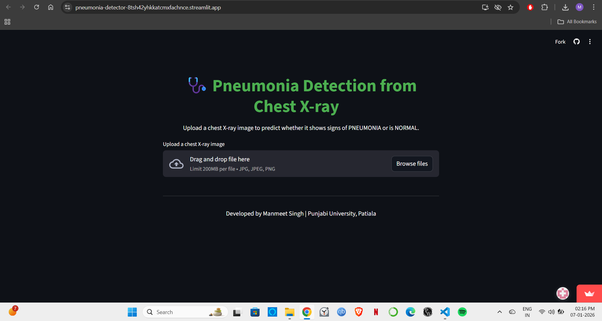
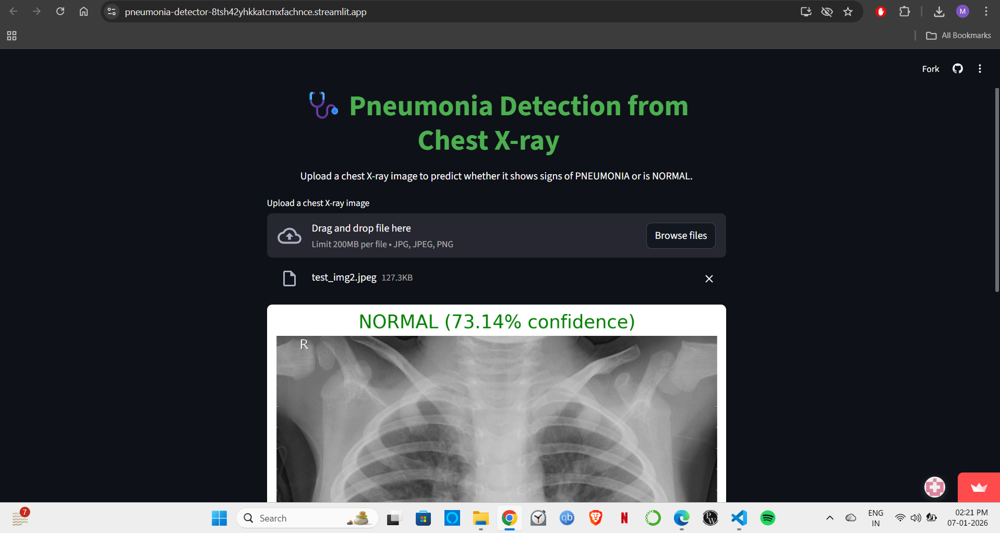

# 🫁 Pneumonia Detection using CNN

A deep learning based web application to detect **Pneumonia from Chest X-Ray images** using a Convolutional Neural Network (CNN).  
Built during Summer Training at **C-DAC Mohali** and deployed using **Streamlit**.

---

## 🚀 Features
- Binary classification: **NORMAL vs PNEUMONIA**
- Custom CNN using TensorFlow/Keras
- Handles **class imbalance** using class weights
- Uses **data augmentation** to reduce overfitting
- Deployed using **Streamlit**
- Achieved **~91% test accuracy**

---

## 🧠 Tech Stack
- Python
- TensorFlow / Keras
- NumPy, OpenCV
- Scikit-learn, Matplotlib
- Streamlit

---

## 🗂️ Dataset
- Kaggle: Chest X-Ray Images (Pneumonia)
- Two classes: NORMAL and PNEUMONIA

---

## 🏗️ Model Architecture
- Conv2D + MaxPooling (3 blocks)
- Flatten → Dense(128) → Dropout(0.5)
- Dense(1) with Sigmoid

Loss: Binary Crossentropy  
Optimizer: Adam  
Callbacks: EarlyStopping, ReduceLROnPlateau

---

## 📊 Results
- Test Accuracy: **~91%**
- Good Precision, Recall, F1-score
- Stable training & validation curves

---

## 🖥️ Demo

### Main Interface


### Prediction Result

.png)   
               

## 🌐 Live Demo

👉 Click here to try the app:  
https://pneumonia-detector-8tsh42yhkkatcmxfachnce.streamlit.app/

## ▶️ How to Run Locally

```bash
pip install -r requirements.txt
streamlit run app.py
